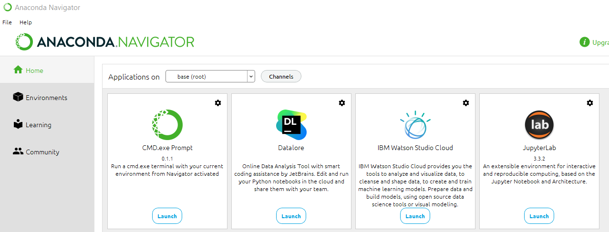

# Credit Worthiness Modeling
Classifying credit risk is challenging because healthy loans outnumber risky loans.
Therefore the problem is inherently imbalanced. 
It is necessary to approach and model credit worthiness through reliable and predictable models which are made available by Machine Learning. 
We use various techniques to train and evaluate models with imbalanced classes. 

# Risk Classificaton - Supervised Machile Learning
This application pedicts risk through Supervised Learning's imbalanced-learn library. 
It uses a dataset of historical lending activiy from a peer-to-peer lending services company to build a model that can identify the credit worthiness of borrowers. 

<!-- TABLE OF CONTENTS -->

  
Table of Contents

  <ol>
    <li>
      <a href="#purpose">Purpose</a>
      <ul>
        <li><a href="#inputs">Inputs</a></li>
        <li><a href="#outputs">Outputs</a></li>
      </ul>
    </li>
    <li>
      <a href="#modeling_techniques">Modeling Techniques</a>
      <ul>
        <li><a href="#pandas">Pandas</a></li>
        <li><a href="#sklearn">sklearn</a></li>
        <li><a href="#balanced-accuracy-score">Balanced Accuracy Score</a></li>
        <li><a href="#confusion-matrix">Confusion Matrix</a></li>
        <li><a href="#classification-report-imbalanced">Classification Report Imbalanced</a></li>
        <li><a href="#train-test-split">Train Test Split</a></li>
        <li><a href="#logistic-regression">Logistic Regression</a></li>
        <li><a href="#accuracy-score">Accuracy Score</a></li>
      </ul>
    </li>
    <li><a href="#version-release">Version Release</a></li>
    <li><a href="#how-to-run">How to run</a></li>
    <li><a href="#usage">Usage</a></li>
    <li><a href="#contributors">Contributors</a></li>
    <li><a href="#license">License</a></li>
        <ul>
        <li><a href="#permissions">Permissions</a></li>
        <li><a href="#disclaimer">Disclaimer</a></li>
        </ul>
    </li>
    <li><a href="#aknowledgements">Aknowledgements</a></li>

---

<!--Purpose -->
## Purpose
This tool employs Supervised Machine Learning to model and identify creditworthiness of borrowers.

### Inputs
The application reads peer-to-peer lending data to build the model.

    lending_data.csv
 
### Process:
1. Analyze the original dataset
2. resample data using "Random Over Sampler" module from an imbalanced library
3. Define target classes to rain a logistic regression classifer
4. Calculate the "Balanced Accuracy Score"
5. Use a "Confusion Matrix" to 
6. Generate a "Classification Report"

### Deliverable:
A Credit Risk Analysis Report is derived from the data output generated by the Classification Report. 
   

    
---
<!--Technologies -->
## Technologies
### Python:

    Phyton Version: **3.7.13**

## Libraries and Dependencies

### Pandas
[pandas](https://pandas.pydata.org/)

### sklearn
[sklearn](https://scikit-learn.org/stable/)

### Balanced Accuracy Score
[balanced-accuracy-score](https://scikit-learn.org/stable/modules/generated/sklearn.metrics.balanced_accuracy_score.html)

### Confusion Matrix
[holoviews](https://scikit-learn.org/stable/auto_examples/model_selection/plot_confusion_matrix.html) 

### Classification Report Imbalanced
[classification_report_imbalanced](https://datascience.stackexchange.com/questions/64441/how-to-interpret-classification-report-of-scikit-learn)

### Train Test Slit
[train_test_split](https://scikit-learn.org/stable/modules/generated/sklearn.model_selection.train_test_split.html)

### Logistic Regression
[logistic_regression](https://scikit-learn.org/stable/modules/generated/sklearn.linear_model.LogisticRegression.html)

### Accuracy Score
[accuracy_score](https://scikit-learn.org/stable/modules/model_evaluation.htm)

---
<!--How to run -->
## How to run
1. Clone the repository on a folder that will easy to open
2. File can run on a Jupyter notebook or Google Colab
3. Open the file with Jupiter using the Anaconda Navigator
4. Navigate open the folder where the files were cloned to
5. Open the file on JupyterLab
ANACONDA - Navigator

6. Make sure to import and install the required libaries and dependencies: 

        Install the required Supervised Learning libraries
            conda activate dev
            conda install -c conda-forge imbalanced-learn

        Import the required libraries and dependencies
            import numpy as np
            import pandas as pd
            from pathlib import Path
            from sklearn.metrics import balanced_accuracy_score
            from sklearn.metrics import confusion_matrix
            from imblearn.metrics import classification_report_imbalanced
            from sklearn.model_selection import train_test_split
            from sklearn.linear_model import LogisticRegression

---
<!--Version Release -->
## Version Release

### Version 1.0

---
<!--Usage -->
## Usage

### Data: Lending data

### Classification Report

### Balanced Accuracy Score and Confusion Matrix:

### Classification Reports: Original and Oversampled

---
<!--Contributors -->
## Contributors

Jeremy Vargas

    Managing Director
    Resonant Solutions LLC
    email:    jeremyvargas@resonantsolutions.org
    linkedin: https://www.linkedin.com/in/jeremyvargas/

UW FinTech Bootcamp
- Startup code provided by institution

---
<!--License -->
## License
Tool is available under an MIT License.

Copyright (c) 2022 - Resonant Solutions, LLC

### Permissions
Permission is hereby granted, free of charge, to any person obtaining a copy of this software and associated documentation files (the “Software”), to deal in the Software without restriction, including without limitation the rights to use, copy, modify, merge, publish, distribute, sublicense, and/or sell copies of the Software, and to permit persons to whom the Software is furnished to do so, subject to the following conditions:

The above copyright notice and this permission notice shall be included in all copies or substantial portions of the Software.
### Disclaimer
The Software is provided “as is”, without warranty of any kind, express or implied, including but not limited to the warranties of merchantability, fitness for a particular purpose and noninfringement. In no event shall the authors or copyright holders be liable for any claim, damages or other liability, whether in an action of contract, tort or otherwise, arising from, out of or in connection with the software or the use or other dealings in the Software.

---
<!--Aknowledgements -->
## Aknowledgements
* [Markdown Guide](https://www.markdownguide.org/basic-syntax/#reference-style-links)

<!-- MARKDOWN LINKS & IMAGES -->
<!-- https://www.markdownguide.org/basic-syntax/#reference-style-links -->