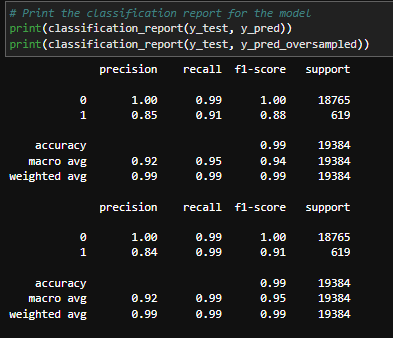

# Credit Worthiness Modeling with Supervised Learning

## Analysis overview
This application pedicts risk through Supervised Learning's imbalanced-learn library.
It uses a dataset of historical lending activity from a peer-to-peer lending services company to build a model that can identify and predict the creditworthiness of borrowers within a high degree of accurary. 

## Inputs
The application reads peer-to-peer lending data to build the model.

    lending_data.csv

## Variables found in the data set
- Loan Size
- Interest Rate
- Borrower Income
- Number of Accounts
- Derogatory Marks
- Total Debt
- Loan Status

### The column: "Loan Status" 
Consisted of only 2 values to indicate if the loan was a "High Risk Loan", given the value of  "1", and a "Healthy Loan" with a value of "0". 
The rest of the features were used to model the create the model and future predictions to determine and predict future risk and credit worthiness measured in "value counts" of a specific label. In order to maximize the computational accuracry of Supervised Machine Learning and apply it to an inbalanced dataset set such as this, the following process was followed

## Process:
1. Analyzed the original dataset (lending_data.csv)
2. Resampled data using "Random Over Sampler" module from an imbalanced library
3. Defined target classes to rain a logistic regression classifer
4. Calculated the "Balanced Accuracy Score"
5. Used a "Confusion Matrix" to 
6. Generated a "Classification Report"

## Models Produced:

### Model #1 - Created a Logistic Regression Model to fit the original data

### Model #2 - Train and fit the model to another Logistic Regression Model of oversampled data, which would be used to predict and determine credit worthiness within realibility and accuracy metrics.

## Credit Risk Analysis Results and Recommendations
A Credit Risk Analysis Report is derived from the data output generated by the Classification Report. 
Based in this analysis, we can can appreciate that the logistic regresion model fits the oversampled data within an acceptable and predictable limit. 
The Healthy Loan ("0") remains at 99% accurate F1-Score. While the High Risk Loan group is calculated at 91%, which is better than the original predicted model calculated at 88%. 
Given these resuts, it is recommended to follow and implement lending rules that support the classification of borrowers based on to Model # 2; which used an oversampled technique to train the model and calculate a recall score of 99% for the "High Risk Loans", and an F-1 score of "91%", which is of course higher than "88%" as the original model calculated. 

